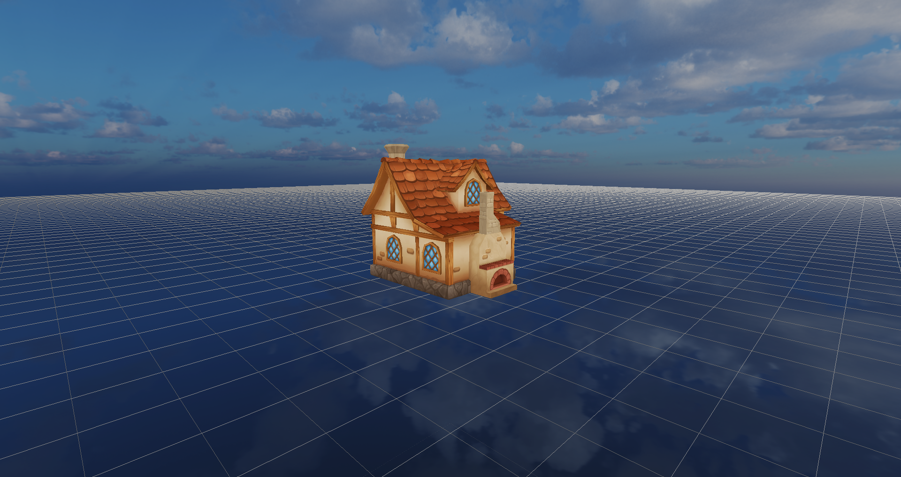
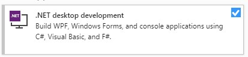

# Diamond-Engine

Diamond Engine is currently under active development as the "Engine Development" subject project for the CITM Bachelor's degree in Video Game Design and Development.

Diamond Engine is a fast C++ 3D game engine, developed with SDL2 and OpenGL. The engine targets optimal memory management, fast starting and loading speeds and simple use. This will provide a fast, simple and powerful tool to prototype good looking games the fastest way possible.

This engine also has a mono-runtime/C# implementation, which allows users to code with C# even though the engine is C++ based. This C# implementation also has hot-reloading, in-engine script editor and optimal memory management.

  

<!--All the documentation and a lot more can be found in the engine web page here:-->

Diamond Engine is currently under indie development by one person, you can check the repository [HERE](https://github.com/MayKoder/Diamond-Engine)

  
# Creators

This engine was made by Miquel Suau Gonzàlez: [GitHub: @MayKoder](https://github.com/MayKoder)

  
# Execution and controls

Simple guide to execute and use the engine:

### Use
- Download the latest release
- Extract the .zip file anywhere
- Open the extracted folder and go to "Diamond-Engine" folder
- Double-click the "Diamond Engine.exe" file

### Controls
- Right click the scene window to rotate the camera like a FPS game.
- While Right clicking on the scene window, use “WASD” to move like a FPS game.
- Use the mouse wheel to zoom in and out.
- Use Alt+LeftClick to orbit around the selected GameObject.
- Press “F” to focus the camera around the selected GameObject.
- Hold SHIFT to duplicate the movement speed.
- Use the mouse wheel click to PAN the camera (Horizontal and Vertical movement)
- Use W, E and R keys while hovering or focusing the scene window to change between ImGuizmo's TRASNLATE, ROTATE or SCALE modes.

### Important to know
- ## IMPORTANT: You need to have the (Visual Studio) .NETFramework version v4.7.2 to run the engine, if you don't have it the engine hot-reloading system won't work and won't even start on some cases.

  

- The first time the engine is executed, it may take a bit longer to start because it has to generate a lot of data (library folder).
- Use the top-middle buttons (Start, Stop, Pause, Step) to run the simulation. C# scripts will be executed during the simulation.
- Avoid hot-reloading while simulating, changes will not apply until the simulation is stopped and there is new changes.
- There is no C# compilation in-engine error check, if the C# can't be compiled, the changed won't apply until the C# side errors are fixed.
- Double click any .cs file in the Assets window to change the current script opened in the Text Editor window.
- Camera culling can be Enabled/Disabled from the camera component.
- The game camera target can be changed from the camera component.
- Shoot the demo tank with the MOUSE-LEFT click while RUNNING the simulation.
- When the simulation starts running, the mouse will be locked and turn invisible. **The mouse can be visible and unlocked clicking the ESC key.**
- Load PlaneScene.des for a cool surprise ;).

#### **Please remember that all the important data (loaded assets, time management, simulation state, editor camera movement settings) can be found inside the "Configuration" window on the right. Also, if it's the first time you use the engine, it will take a bit longer to start, it's generating the library files :).**

  
# Features

Engine v0.1
 - Take cool screenshots with the "Take Screenshot" button located on the top-middle bar. (Screenshots will ignore editor layer).
 - Optimized scene window rendering, displaying only the needed section of the frame buffer, reducing wasted pixels and improving performance.
 - Style customization, save and load custom styles created with the "Style Settings" tab inside the "Configuration Window" window.
 - Move, rotate and scale models with correct parent-to-child transformations.
 - Default Skybox, for the ones tired of looking at empty black backgrounds. Had to reduce the texture size and will look low-res until shaders are added.
 - Camera pan movement with the mouse wheel click.
 - Use the "Supr" key to delete the selected GameObject and all the children inside it.
 - Enable / Disable components.
 - Focus on memory management, no memory leaks.
 - Use of hyperlinks with ImGui.
 - Drag&Drop from any supported file format from anywhere on the disc, file will be duplicated in the "Assets" folder.
 - Console log have types (Normal, Warning and Error) indicated by colors. 
 - Console logs can stack up if the value is the same and are equal as the last log.
 - Console logs and console can also be cleaned.
 
Engine v0.2
 - Resource manager will make sure that assets are loaded only once in memory, and unloaded when they are not used anymore.
 - Play/Pause/Stop/Step buttons. You can now press PLAY, move, remove or do anything to the scene, and when you stop playing you will recover the original state of the scene. This system is also ready to be used with a deltaTime an a timeScale for future simulations.
 - You can now change a GameObject's parent by dragging it on top of the desired parent of the Hierarchy. Transformations will be respected with every parent change.
 - Create empty GameObjects with right-click. If a GameObject is selected, the new empty GO will be added as a child.
 - Meshes can be changed by dragging a different mesh from the asset window to the mesh panel inside the mesh component. 
 - Textures can be changed by dragging any texture from the assets window to the texture display inside the material component. 
 - Models can be loaded as GameObject by dragging them from the assets window to the scene window. 
 - Components and GameObject can be removed and deactivated. 
 - Components can be added from the inspector display with the "Add component" drop-down.
 - Resource manager process can be visualized on the console and the "Loaded resources" tab. 
 - Library folder can be removed and the code will regenerate all the data with the same Id's to keep saved scenes valid. 
 - Each mesh component controls its own AABB and OBB display. 
 - **Innovation:** You can now delete assets from the asset window and the library and meta files will be deleted as well. 
 - **Innovation:** Multiple scene display, enjoy the views from the game camera and move it around. No debug info will be displayed on the game camera and you can render the editor and the game camera at the same time. 
 
 Engine v0.3
 - C# support added with mono-runtime.
- mono-runtime is now portable, so no installation is needed to run and work with the engine.
- Home made C# libraries like Vector3, Quaternion, mat4x4...
- C# input/transform support with extern functions.
- Inspector display variables which values can be modified in-engine.
- C# exception handling, if something goes wrong in the C# side while running a script, a LOG message with the error will notify the user (just a generic error for now but working on a full handler). Careful, this handler could not work if you are launching the engine from the source code (Visual Studio) because you need to tell visual to ignore the Update exceptions so the handler can catch them. (This exception will launch at CO_Script::Update() method, and you need to tell visual to ignore that kind of exceptions, it's a checkbox under the popup exception window in Visual Studio).
- GameObject drag & drop to C# variables, if a variable is a GameObject, one GameObject can be dropped on top of the variable to assign that GO to the C# variable.
- Optimal C# GO management, the C# GO class will only store a pointer to the C++ GameObject, making it a lot faster to find GameObjects when sending them from C# to C++.
- **Innovation:** C# hot-reloading, all changes made to a script will cause a hot-reload. Saving "CTRL+S" on Visual Studio (C#) will also trigger a hot-reload and all changes will apply to the current loaded scene.
- Modified variables will be saved with the scene, so all variables will be loaded as they where with the scene, even GameObjects in the same parent tree.
- If a script reference is missing, the user will be notified.
- **Innovation:** Scene saving and loading using GetOpenFileNameA and GetSaveFileNameA. 
- **Innovation:** No memory leaks nor memory usage increments. (maybe not innovation but I'm proud of it, so I'm adding it).
- **Innovation:** Folder/File icons, had more ready to add but I run out of time for the assignment.
- **Innovation:** The added Text Editor can modify scripts, open the C# Visual project and even hot-reload scripts.
- **Innovation:** Console log icons, images are better than text with colors.
- **Innovation:** All scripts can be added to any GameObject with the "Add Component" dropdown.
- **Innovation:** Create scripts left-clicking inside the Assets window, this scripts will be automatically  added to the C# solution and can be edited without the need of a restart (Unity style).
 
 
  
# Short-Term TODO list:

 - Resource manager should update files if the last modified date is changed, but if a file is changed while the engine is closed, this update won't happen until the file is changed again with the editor running. 
 - Add icons to every button possible, images are better than text. 
 - .model file optimizations, saving a lot of useless data. 
 - Convert all the component system to C# components.
 - Add more style, the engine looks default/flat.
 - Add space-partitioning, event system, physics and animations.

  
## AGPL-3.0 License

Diamond Engine, lightweight 3D game engine software.

Copyright (C) 2020  Miquel Suau Gonzalez

This program is free software: you can redistribute it and/or modify
it under the terms of the GNU Affero General Public License as published
by the Free Software Foundation, either version 3 of the License, or
(at your option) any later version.

This program is distributed in the hope that it will be useful,
but WITHOUT ANY WARRANTY; without even the implied warranty of
MERCHANTABILITY or FITNESS FOR A PARTICULAR PURPOSE.  See the
GNU Affero General Public License for more details.

You should have received a copy of the GNU Affero General Public License
along with this program.  If not, see https://github.com/MayKoder/Diamond-Engine/blob/master/LICENSE.

  - Contact at GitHub: https://github.com/MayKoder
  - Contact at LinkedIn: https://www.linkedin.com/mwlite/in/miquel-suau-gonzalez
  - Contact at Gmail: sg.miquel@gmail.com 
